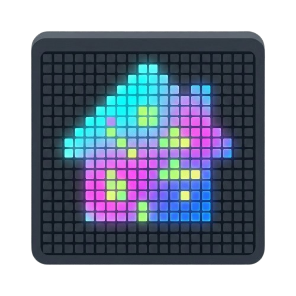

<div align="center">



# iPIXEL Enhanced for Home Assistant

**A feature-rich Home Assistant integration for iPIXEL Color LED matrix displays
(32×32 and similar) over Bluetooth — with a visual page designer, emoji support,
and a live 32×32 preview right inside the dashboard.**

[](https://github.com/ptitzgeg-on-git/ha-ipixel-enhanced/releases)
[](LICENSE)
[](https://hacs.xyz/)
[](https://www.home-assistant.io/)

Enhanced fork of [cagcoach/ha-ipixel-color](https://github.com/cagcoach/ha-ipixel-color) (GPL-3.0).

</div>

## The hardware

This drives the cheap **32×32 RGB pixel panels** sold under names like
**B.K. Light** (e.g. at **Action**) and other *iPIXEL Color* / `LED_BLE_*`
Bluetooth matrices:

<p>
  
  
</p>

> Product photos © Action — shown for identification only.

---

## What makes it "enhanced"

- **Page designer card** — build pages by dropping widgets (text, sensor,
  emoji, rendered clock, line, rectangle, progress bar, image, **animated GIF**,
  and the panel's **native clock**) onto a 32×32 canvas. Pick a position from a
  9-point anchor grid (top-left, center, bottom-right…) or type exact `x`/`y`.
  No coding required.
- **Live preview** — the card renders your page server-side and shows it
  pixel-perfect as you edit, like a Zigbee2MQTT-style editor.
- **Code mode** — power users get the raw page JSON for fine control.
- **Templates everywhere** — any text field accepts Jinja2, e.g.
  `{{ states('sensor.temperature') }}°`.
- **Emoji** — any emoji via Twemoji, auto-downloaded and cached.
- **Animated GIFs** — a `gif` widget composites the page into a multi-frame GIF
  the panel plays natively.
- **Named playlists, per panel** — build several playlists (e.g. *Morning*,
  *Night*) and start one from the card or an automation (`start_playlist`).
  Each panel runs its **own** playlist independently, and a single playlist can
  play on **several panels at once** — they never fight over a timer.

Everything is generic: it is **not** tied to any specific use case. You build
the pages you want.

> **🆕 New in 0.7.0:** playlists are now **per panel** and can target **several
> panels at once**. See the full [CHANGELOG](CHANGELOG.md).

---

## Installation (HACS)

1. HACS → Integrations → ⋮ → **Custom repositories**
2. Add `https://github.com/ptitzgeg-on-git/ha-ipixel-enhanced` as **Integration**
3. Install **iPIXEL Enhanced**, then **restart** Home Assistant
4. Settings → Devices & Services → **Add Integration** → search **iPIXEL**

The designer card is registered automatically — no manual resource needed.

---

## Using the iPIXEL Studio

After install, an **iPIXEL** entry appears in the Home Assistant **sidebar** —
open it for the full studio. (You can also add it to any dashboard with
`type: custom:ipixel-card`.) Pick your device top-right (multiple panels
supported), then use the tabs:

- **🎨 Designer** — build a page from widgets with a live 32×32 preview; bind HA
  entities with the *＋ HA entity* picker; **Send now** or save to your library.
  Visual editor + a Code (JSON) mode.
- **✏️ Draw** — a clickable 32×32 grid: pick a colour and brush size, then paint.
  **Send drawing** pushes the whole picture; **Live draw** lights each pixel on
  the panel as you click (enables the device's DIY mode). No service calls needed.
- **🔁 Playlist** — build **named playlists** and Start/Stop them; each page
  re-renders on its interval so dynamic data stays live. Tick one or more
  **target panels** to run the same playlist on several displays, or give each
  panel its own. Saving a running playlist applies the edits live. Launchable
  from automations with `start_playlist` / `stop_playlist`.
- **💾 Slots** — push library pages (with a thumbnail preview) into the panel's
  own memory, recall or edit them, and make the panel **loop several slots by
  itself** (works with HA off).
- **⚙️ Device** — power, brightness, orientation, DIY mode and clock style, all
  in one place.

So `set_pixel`, `set_program`, etc. are driven from the UI — no need to call
those services by hand. See **[WIDGETS.md](WIDGETS.md)** for the widget
reference and **[AUTOMATIONS.md](AUTOMATIONS.md)** for automation recipes.

## Wrong size / cropped display?

Some panels — notably the **32×32 B.K. Light sold at Action** — report wrong
dimensions over Bluetooth. Go to **Settings → Devices & Services → iPIXEL →
Configure** and enable **Override panel dimensions**, then set the real width
and height (e.g. 32 × 32).

## Multiple displays

Add each display as a separate integration entry (they're auto-discovered).
The designer's device dropdown, the `show_page` service target, and the
playlist **target panels** all let you address specific panels — and each
panel keeps its own running playlist, so two displays can show different
rotations at the same time. Each panel also gets its own **Playlist** select
entity, so you can drive it straight from an automation.

---

## Services

| Service | Purpose |
|---|---|
| `ipixel_color.show_page` | Render a saved page (`name`) or an inline `page` and push it to a device. Optional `save_slot` stores it on the device. |
| `ipixel_color.show_text` | Quick scrolling text (templates supported). |
| `ipixel_color.show_emoji` | Show a single emoji. |
| `ipixel_color.show_clock` | Switch the panel to its native clock mode (ticks on the device). Use this from automations. |
| `ipixel_color.show_image` | Send an image or **animated GIF** (URL or `/local/...`). GIFs play natively. |
| `ipixel_color.set_orientation` | Rotate the display (0/90/180/270°). Also an **Orientation** select entity. |
| `ipixel_color.set_fun_mode` | Toggle the panel's built-in effect mode. Also a **Fun Mode** switch. |
| `ipixel_color.show_slot` / `delete_slot` | Recall / delete a program stored in device memory. |
| `ipixel_color.set_program` | Make the panel loop several stored slots by itself. |
| `ipixel_color.start_playlist` / `stop_playlist` | Start a **named** playlist (created in the card) on one or more panels (`device_id`, accepts several), or stop it on the chosen panels. |
| `ipixel_color.set_playlist` | Legacy on/off shim — `enable: false` stops playback; use `start_playlist` to start. |

See **[AUTOMATIONS.md](AUTOMATIONS.md)** for ready-to-use automation examples
(arrival page, day/night playlist, doorbell alert, GIFs, device slots…).

### Extra entities

Each display also exposes an **Orientation** select and a **Fun Mode** switch,
on top of power, brightness, clock style, font, etc.

### Fonts

Bundled pixel fonts render crisp on the matrix: **Tiny5** (default, most
readable), WP7xn, PixelifySans, 7x5, 5x5, PressStart2P (retro, wide), plus
OpenSans-Light. Color emoji are drawn with the `emoji` widget.

Example automation:

```yaml
- alias: Rain alert on display
  trigger:
    - platform: numeric_state
      entity_id: sensor.rain_probability
      above: 60
  action:
    - service: ipixel_color.show_page
      target:
        device_id: <your_device>
      data:
        page:
          background: "001020"
          widgets:
            - { type: emoji, emoji: "🌧️", anchor: top_center, size: 14 }
            - { type: text, text: "{{ states('sensor.rain_probability') }}%",
                anchor: bottom_center, color: "5aa0ff", font: "5x5" }
```

---

## Requirements

- Home Assistant 2024.7+
- HACS
- An iPIXEL Color LED display (`LED_BLE_*`)
- Bluetooth adapter or an HA Bluetooth proxy

---

## Development & tests

Most of the integration's logic is pure Python (image/widget rendering, colour
parsing, BLE frame encoding, playlist sequencing) and is covered by an offline
test suite that needs neither Home Assistant nor the panel:

```bash
pip install -r requirements-test.txt
pytest
```

The suite stubs the few `homeassistant.*` modules the pure code imports (see
`tests/conftest.py`) and exercises the real bundled fonts. Rendering is checked
by asserting on the produced pixels rather than byte-exact image snapshots, so
the tests stay stable across Pillow versions.

**Not covered (requires hardware):** the BLE transport (`bluetooth/`,
`api.connect`/send) and the `pypixelcolor` command wrappers. The PNG→BLE path is
shared with `show_text`/`show_emoji`, so on-device behaviour is validated by
sending an actual page to the panel.

## Looking for the ESP32 route?

If you prefer a dedicated ESP32 gateway (better BLE range, GIF/online images),
see [@DonKracho's ESPHome component](https://github.com/DonKracho/ESPHome-component-iPixel-ble).
This project is the **direct Home Assistant** integration — no extra hardware.

---

## Credits & acknowledgements

This project stands on the shoulders of others — huge thanks to:

- **[@cagcoach](https://github.com/cagcoach/ha-ipixel-color)** — the original
  `ha-ipixel-color` integration this is forked from. The Bluetooth integration
  foundation and much of the device handling come from his work.
- **[@DonKracho](https://github.com/DonKracho/ESPHome-component-iPixel-ble)** —
  his ESPHome iPixel BLE component was an invaluable reference for understanding
  the panel's protocol. No code was copied; the protocol insights helped
  validate ours (see [PROTOCOL.md](PROTOCOL.md)).
- **[Twemoji](https://github.com/twitter/twemoji)** — the color emoji artwork.

If you build on this project, please keep these credits.

---

## License

This integration is **free software** under the **[GNU General Public License
v3.0](LICENSE)**, because it is a derivative work of
[ha-ipixel-color](https://github.com/cagcoach/ha-ipixel-color) (GPL-3.0).

```
Copyright (C) 2024-2026  dwayne (@ptitzgeg-on-git)
Based on ha-ipixel-color, Copyright (C) cagcoach

This program is free software: you can redistribute it and/or modify it under
the terms of the GNU General Public License as published by the Free Software
Foundation, either version 3 of the License, or (at your option) any later
version. It is distributed WITHOUT ANY WARRANTY. See the LICENSE file for the
full text.
```

**What the GPL means for you and for this project:**

- ✅ You may use it (including commercially), study it, share it, and modify it.
- 🔒 **Copyleft / share-alike:** if you distribute a modified version, you
  **must** release your changes under the GPL-3.0 too, with source — nobody can
  turn this work into a closed/proprietary product.
- 🙏 You must keep the copyright and credit notices above.

> The GPL **cannot** forbid commercial use or modification — that is by design,
> and it is the licence inherited from the upstream project. What it *does*
> guarantee is that improvements stay open and you stay credited.
